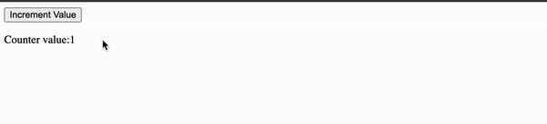

# Ayr.js


Ayr.js is a reactivity model designed for simplicity.  No build tools.  No templating engines. Just HTML and Javascript.

## Installation

Install my-project with npm

```bash
  npm install my-project
  cd my-project
```

## Usage/Examples

The core of `Ayr.js` is the 'Ayr Component' (`AC`).  Ayr components are functions that take an Ayr config and translate that config object to reactive state.  The three core pieces of an Ayr component are: `root`, `state`, and `effects`. (Full API below)

| option | Description                |
| :-------- | :------------------------- |
| `root` | **Required**. Where the Ayr component should mount in the DOM |
| `state` | Reactive state variables |
| `effects` | Function that returns an functions that mutate `state` variables |


An example Ayr component:

```javascript
AC({
    root: '#my_component',
    state: {
        counter: 1,
    },
    effects: function() {
        return {
            incrementCounter: () => {
                this.state.counter  = this.state.counter + 1;
            }
        }
    }
})
```

This Ayr component will be mounted at the HTML element with `id="my_component"`, and has one reactive `state` value ('counter'), with one `effect` ('incrementCounter').

Ayr components also have a HTML counterparts - attributes on your HTML elements telling `Ayr.js` where to render.  Using the above Ayr component as an example, the corresponding HTML could look like this:

```html
<div id='my_component'>
    <button y-click="{incrementCounter}">Increment Value</button>
    <p>
        Counter value:
        <span y-data="{counter}"></span>
    </p>
</div>
```

Here you can see the `id="my_component"` (mirroring the `root` value of the `AC`), as well as two Ayr directives: `y-click` and `y-data`.
Whichever tag the `y-data` directive is attached to will render the value of the state variable passed.  In this case, the `counter` state variable will render its current value in the `span` tag.  The `y-click` directive is passed the 'incrementCounter' effect.  When the `button` element is clicked, the 'incrementCounter' effect is called.

The full example:



```javascript
<!Doctype html>
<head>
    <script>
        AC({
            root: '#my_component',
            state: {
                counter: 1,
            },
            effects: function() {
                return {
                    incrementCounter: () => {
                        this.state.counter  = this.state.counter + 1;
                    }
                }
            }
        })
    </script>
</head>
<body>
    <div id='my_component'>
        <button y-click="{incrementCounter}">Increment Value</button>
        <p>
            Counter value:
            <span y-data="{counter}"></span>
        </p>
    </div>
</body>
```


### More Examples

#### Dependants
`Ayr.js` also has a concept of derived state in the form of `dependants`.  '`dependants`' is an option for an Ayr component, which is a function that returns an object of functions, each returning some new state.  The function name in the top object can then be used as a regular state variable, and bound using the `y-data` directive.  Building off the counter example:

```javascript
<!Doctype html>
<head>
    <script>
        AC({
            root: '#my_component',
            state: {
                counter: 1,
            },
            effects: function() {
                return {
                    incrementCounter: () => {
                        this.state.counter  = this.state.counter + 1;
                    }
                }
            },
            dependants: function() {
                return {
                    doubledCounter: (e) => {
                        return this.state.counter * 2
                    },
                    tripledCounter: () => {
                        return this.state.counter * 3
                    }
                }
            }
        })
    </script>
</head>
<body>
    <div id='my_component'>
        <button y-click="{incrementCounter}">Increment Value</button>
        <p>
            Counter value:
            <span id="test" y-data="{counter}"></span>
            Doubled:
            <span y-data="{doubledCounter}"></span>
            Tripled:
            <span y-data="{tripledCounter}"></span>
        </p>
    </div>
</body>
```

These `dependants` will be updated whenever the state variable they depend on (in this case, 'counter') has been updated. 

#### Conditional Rendering
The `y-if` directive can be passed a state variable, and that DOM node will only be shown when the state variable evaluates to `true`.
```javascript
<!Doctype html>
<head>
    <script>
        AC({
            root: '#my_component',
            state: {
                showMessage: false,
            },
            effects: function() {
                return {
                    toggleMessage: () => {
                        this.state.showMessage  = !this.state.showMessage;
                    }
                }
            }
        })
    </script>
</head>
<body>
    <div id='my_component'>
        <button y-click="{toggleMessage}">Toggle Message</button>
        <p y-if="{showMessage}">
            This is a dynamic message. 
        </p>
    </div>
</body>
```
* Note: `y-if` does not remove the node completely, it merely toggles `display: none;` on the given element.


#### Looping
The `y-for` directive can be passed an iterable state variable, allowing you to create DOM elements by iterating through a list.
```javascript
<!Doctype html>
<head>
    <script>
        AC({
            root: '#my_component',
            state: {
                values: [ 'First Value', 'Second Value', 'Third Value' ],
            }
        })
    </script>
</head>
<body>
    <div id='my_component'>
        <p y-for="{v in values}">
            <span y-data="{v}"></span> 
        </p>
    </div>
</body>
```

## API Reference

#### Ayr Components

| AC option | Description                |
| :-------- | :------------------------- |
| `root` | **Required**. Where the Ayr component should mount in the DOM |
| `state` | Reactive state variables |
| `effects` | Function that returns functions which mutate `state` variables |
| `dependants` | Function that returns derived state functions |


#### Ayr Directives


| AC option | Description                |
| :-------- | :------------------------- |
| `y-data` | Binds node to AC state variable |
| `y-[event]` | Binds DOM `event` on the node to an AC effect (e.g.: `y-click`, `y-change`). See below for supported events |
| `y-if` | Binds visibility of a DOM node to the truthiness of a state variable |
| `y-for` | Loops over iterable state variable and renders child `y-data`  |

* Supported `y-[event]` DOM events: `click`, `change`, `keydown`, `keyup`, `mouseover`, `mouseout`


## Contributing

Contributions are always welcome!

Please open a pull request or open an issue to collaborate.


## Notes
`Ayr.js` is not yet ready for use in production.  This is an early stage project and the API is still subject to breaking changes.  If you like `Ayr.js` check out the frameworks that inspired it:
- [Alpine.js](https://alpinejs.dev/)
- [Solid.js](https://www.solidjs.com/)

## Authors

- [@kyleplump](https://github.com/kyleplump)

